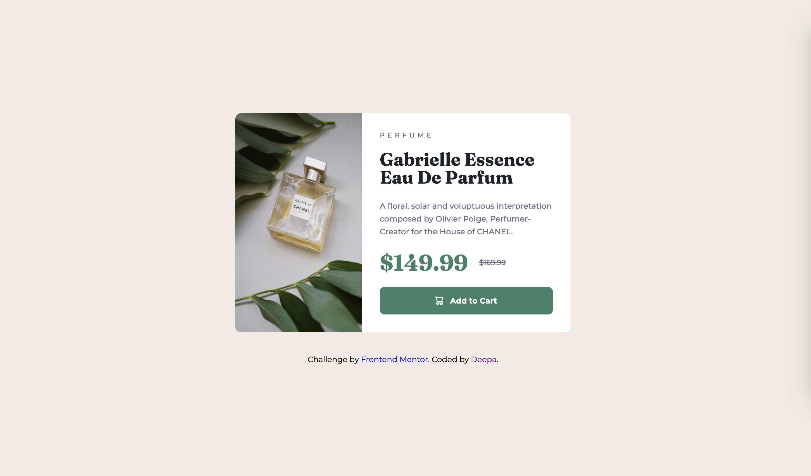
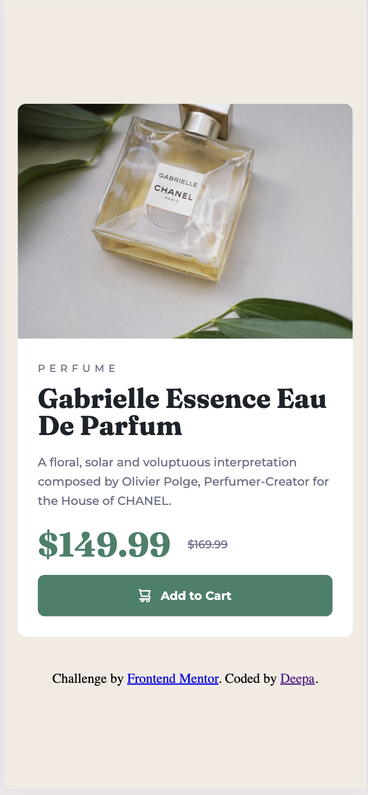

# Frontend Mentor - Product preview card component solution

This is a solution to the [Product preview card component challenge on Frontend Mentor](https://www.frontendmentor.io/challenges/product-preview-card-component-GO7UmttRfa). Frontend Mentor challenges help you improve your coding skills by building realistic projects. 

## Table of contents

- [Overview](#overview)
  - [The challenge](#the-challenge)
  - [Screenshot](#screenshot)
  - [Links](#links)
- [My process](#my-process)
  - [Built with](#built-with)
  - [What I learned](#what-i-learned)
  - [Continued development](#continued-development)
  - [Useful resources](#useful-resources)
- [Author](#author)
- [Acknowledgments](#acknowledgments)

**Note: Delete this note and update the table of contents based on what sections you keep.**

## Overview

### The challenge

Users should be able to:
- View the optimal layout depending on their device's screen size
- See hover and focus states for interactive elements

### Screenshot



<hr />



### Links


* https://github.com/sdkdeepa/product-preview-card
<br />

* [Live Site URL](https://sdkdeepa.github.io/product-preview-card)

## My process

### Built with

- Semantic HTML5 markup
- CSS custom properties
- Flexbox
- CSS Grid
- Mobile-first workflow

### What I learned

I learnt how to use `<figure>`,`<picture>`, `<source>` and `<del>`
```HTML
    <figure>
      <picture>
        <source srcset="images/image-product-desktop.jpg" media="(min-width: 1024px)">
        
      </picture>
    </figure>
<!-- You don't need to use css to strike through the text -->
    <del>$169.99</del>

```

### Useful resources
- [Webdev](https://www.webdev.dev) - This material really helped me in building responsive app and made my job easier on scaling the image.

## Author

**Frontend Mentor - [@sdkdeepa](https://www.frontendmentor.io/profile/sdkdeepa)**


